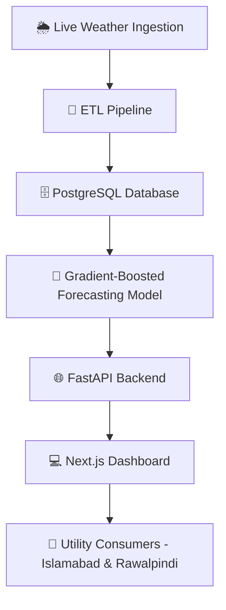

<div align="center">

# ⚡ VoltaIQ
### End-to-End Consumer Outage Prediction Platform

**Helping IESCO-area consumers in Islamabad & Rawalpindi see outage risk before it happens.**


**[🌐 Live App](https://volta-iq-tau.vercel.app) · [📦 Repository](https://github.com/Noor-Rehman/voltaiq)**

</div>

---

## 🔌 Overview

**VoltaIQ** is a full-stack platform that predicts **power outage risk before it happens**, giving utility customers in Islamabad and Rawalpindi visibility into when and how likely an outage is. It's an end-to-end system: **live weather data ingestion → ETL → a gradient-boosted forecasting model → a FastAPI backend → a Next.js dashboard**, all built and shipped as a single working product rather than just a notebook experiment.

> 🎯 **Core idea:** Weather is one of the biggest drivers of grid stress and outages. VoltaIQ ingests live weather signals, transforms them into model-ready features, and forecasts outage risk with a gradient-boosted model — surfaced through a real dashboard consumers can actually check.

**📊 Model Performance**

| Metric | Value |
|---|---:|
| Cross-Validated R² | **0.921** |
| Mean Absolute Error (MAE) | **0.48 hrs** |

---

## ✨ Key Features

- 🌦️ **Live weather ingestion** feeding directly into the prediction pipeline
- 🔄 **ETL pipeline** transforming raw weather/grid data into model-ready features
- 🌲 **Gradient-boosted forecasting model** for outage risk prediction
- 📉 Strong predictive performance — **R² = 0.921**, **MAE = 0.48 hrs**
- 🌐 **FastAPI backend** serving predictions via REST endpoints
- 💻 **Next.js dashboard** for consumers to check outage risk
- 🗄️ **PostgreSQL** for persistent storage of weather, grid, and prediction data
- 🚀 Deployed and **live** — not just a local prototype

---

## 🏗️ Architecture



---

## 🔬 Pipeline Breakdown

### 1️⃣ Weather Ingestion
Live weather data is continuously pulled in as the primary leading signal for grid stress — since environmental conditions are one of the strongest drivers of outage risk.

### 2️⃣ ETL
Raw weather and grid data is cleaned, transformed, and engineered into features suitable for modeling — bridging the gap between messy live data and a trainable dataset.

### 3️⃣ Forecasting Model
A **gradient-boosted regression model** predicts outage risk/timing from the engineered features, validated via cross-validation to achieve an **R² of 0.921** and **MAE of 0.48 hours**.

### 4️⃣ Backend API
A **FastAPI** service exposes the model's predictions as REST endpoints, connecting the ML layer to the consumer-facing product.

### 5️⃣ Dashboard
A **Next.js** frontend turns raw predictions into a clean, checkable outage-risk view for everyday consumers — deployed live on Vercel.

---

## 📁 Repository Structure

```text
VoltaIQ/
├── backend/          # FastAPI application, API routes, prediction serving
├── frontend/          # Next.js dashboard (deployed to Vercel)
├── ml_model/           # Gradient-boosted outage prediction model
├── database/            # PostgreSQL schema, migrations, and config
├── data/                  # Weather and outage datasets, ETL outputs
├── requirements.txt       # Python backend dependencies
├── package-lock.json      # Frontend dependency lockfile
└── README.md
```

---

## 🛠️ Technologies Used

**Backend & ML**


**Frontend & Deployment**


---

## ⚙️ Installation

### 1. Clone the repository

```bash
git clone https://github.com/Noor-Rehman/VoltaIQ.git
cd VoltaIQ
```

### 2. Backend setup

```bash
python -m venv .venv
source .venv/bin/activate   # On Windows: .venv\Scripts\activate
pip install -r requirements.txt
```

Configure your PostgreSQL connection (e.g. via a `.env` file — see `database/` for schema/config).

```bash
cd backend
uvicorn main:app --reload
```

### 3. Frontend setup

```bash
cd frontend
npm install
npm run dev
```

---

## ▶️ Usage

1. 🌦️ Weather data is ingested and passed through the ETL pipeline.
2. 🌲 The gradient-boosted model scores current conditions for outage risk.
3. 🌐 The FastAPI backend serves these predictions via REST endpoints.
4. 💻 The Next.js dashboard displays outage risk to consumers in real time.
5. 👤 Users check the live dashboard to see their current outage risk.

---

## 🔭 Future Improvements

- 📱 Push/SMS alerts for high-risk outage windows
- 🏙️ Expansion beyond Islamabad/Rawalpindi to other DISCOs
- 🛰️ Additional weather and grid-load data sources for richer features
- 🧠 Model upgrades (e.g. ensemble/deep learning comparison against the gradient-boosted baseline)
- 📊 Historical outage accuracy tracking and public model transparency
- ☁️ Production-grade CI/CD, monitoring, and alerting infrastructure

---

## 📜 License

This project is developed for **academic and educational purposes**.

---

## 👤 Author

<div align="center">

**Noor Rehman**
BS Data Science · Air University, Islamabad, Pakistan

*VoltaIQ — seeing the outage before it happens* ⚡

</div>
